# AIM (Intentional Computing App)

AIM is an AI-powered focus management application that helps users practice intentional computing. It captures screens periodically and analyzes whether the user's current activity aligns with their set goals using LLM analysis, providing real-time feedback.

## Key Features

- **Real-time Screen Analysis**: Periodically captures screens and analyzes current activities
- **AI-powered Intent Analysis**: Uses LLM to analyze alignment between user activities and set goals
- **3 App Modes**: Supports FULL(Purple), REMINDER(Blue), and BASIC(Orange) modes
- **Real-time Feedback**: Provides immediate notifications and advice based on focus levels
- **Learning System**: Improves analysis accuracy through user feedback
- **Multi-language Support**: Supports Korean/English UI
- **Session Management**: Tracks work sessions and manages history

## Software Architecture

### Overall System Architecture


### Detailed Module Structure


### Data Flow

```mermaid
sequenceDiagram
    participant U as User
    participant D as Dashboard
    participant M as ThreadManager
    participant C as Screen Capture
    participant L as LLM Analysis
    participant S as Storage
    participant N as Notification
    
    U->>D: Set Goal & Start
    D->>M: Request Capture Start
    
    loop Periodic Analysis (2 second intervals)
        M->>C: Capture Screen
        C->>M: Return Screenshot
        M->>L: Request LLM Analysis (Image + Context)
        L-->>LLM API: Analysis Request
        LLM API-->>L: Focus Score & Message
        L->>M: Return Analysis Result
        M->>S: Store Result
        M->>N: Show Notification if Needed
        N->>U: Feedback Notification
    end
    
    U->>D: Provide Feedback (👍/👎)
    D->>M: Send Feedback
    M->>S: Store Learning Data
```



## How to Run

```bash
# Install dependencies
pip install -r requirements.txt

# Run application
python main.py
```

## System Requirements

- **OS**: macOS 10.15 or later
- **Python**: 3.8 or later
- **Required Permissions**: 
  - Screen Recording Permission
  - Accessibility Permission
  - Notification Permission

## Configuration

In the current version, you need to configure the LLM API endpoint in `src/config/constants.py`:

```python
LOCAL_BASE_URL = "your-llm-api-endpoint-here"
```

> **Future Update**: The app will be improved to work with API keys only. You'll be able to directly enter OpenAI/Claude API keys without needing a separate backend server.

## App Modes

- **FULL (Purple)**: Provides complete functionality with real-time feedback and notifications
- **REMINDER (Blue)**: Provides only periodic reminder notifications
- **BASIC (Orange)**: Performs basic monitoring with minimal UI feedback

## License

This project was developed for research purposes.
