# Intentional Computing App - Architecture Documentation

## Bad Feedback Reflection System

### Overview
When a user provides "bad" feedback (👎) on the LLM response, the system triggers a sophisticated reflection mechanism to learn from the negative feedback and improve future responses.

### System Architecture

```mermaid
graph LR
    subgraph "UI Layer"
        A["Dashboard<br/>👎 Bad Button"]
        B["Feedback UI<br/>Visual Response"]
    end
    
    subgraph "Processing Layer"
        C["FeedbackManager<br/>Orchestration"]
        D["ReflectionThread<br/>Background Processing"]
    end
    
    subgraph "Data Layer"
        E["ThreadManager<br/>Memory Storage"]
        F["PromptConfig<br/>File Storage"]
        G["LocalStorage<br/>Persistent Data"]
    end
    
    subgraph "External Services"
        H["Cloud LLM<br/>Reflection Analysis"]
    end
    
    subgraph "Integration Layer"
        I["Prompt System<br/>Context Injection"]
        J["Future LLM Calls<br/>Enhanced Context"]
    end
    
    A --> C
    A --> B
    C --> D
    D --> H
    D --> F
    D --> E
    E --> I
    F --> I
    I --> J
    J --> A
```



### Reflection Flow Diagram

```mermaid
graph TD
    A["👎 User Clicks Bad Button<br/>Dashboard.send_feedback('bad')"] --> B{"Data Available?<br/>feedback_manager &&<br/>last_llm_response &&<br/>current_task"}
    
    B -->|No| C["Log Warning<br/>Skip Reflection"]
    B -->|Yes| D["Extract Data<br/>• task_name<br/>• previous_reason<br/>• image_path"]
    
    D --> E["FeedbackManager<br/>process_negative_feedback()"]
    E --> F["Generate Reflection Prompt<br/>format_reflection_prompt()"]
    F --> G["Create ReflectionThread<br/>Background QThread"]
    
    G --> H["Send to Cloud LLM<br/>LLM_CHAT_API_ENDPOINT"]
    H --> I{"LLM Response<br/>Success?"}
    
    I -->|Error| J["Handle Error<br/>Log & Continue"]
    I -->|Success| K["Parse JSON Response<br/>• image_description<br/>• reflected_implicit_intention"]
    
    K --> L["Save to Storage<br/>prompt_config.save_reflection()"]
    L --> M["Format Reflection Entry<br/>'description': 'intention'"]
    M --> N["Update Dashboard Cache<br/>current_reflection_data.append()"]
    N --> O["Update ThreadManager<br/>set_reflection_data()"]
    
    O --> P["Memory Storage<br/>current_reflection_data"]
    P --> Q["Future Prompt Integration<br/>get_formatted_prompt()"]
    Q --> R["Enhanced LLM Context<br/>use_reflection=True"]
    
    R --> S["Improved Future Responses<br/>Learning Loop Complete"]
```



### Sequence Diagram

```mermaid
sequenceDiagram
    participant U as 👤 User
    participant D as Dashboard
    participant FM as FeedbackManager
    participant RT as ReflectionThread
    participant LLM as Cloud LLM
    participant PC as PromptConfig
    participant TM as ThreadManager

    Note over U,TM: Bad Feedback Reflection Sequence

    U->>D: Click 👎 Bad Button
    D->>D: Show visual feedback (red highlight)
    
    alt Data Available (feedback_manager && last_llm_response && current_task)
        D->>D: Extract data (task_name, previous_reason, image_path)
        D->>FM: process_negative_feedback()
        
        FM->>FM: Generate reflection prompt using format_reflection_prompt()
        FM->>RT: Create ReflectionThread and start()
        
        RT->>RT: Encode image to base64 format (if available)
        RT->>RT: Prepare request data with type: "reflection" + image data
        RT->>LLM: POST request to LLM_CHAT_API_ENDPOINT (with image)
        
        alt LLM Returns Success
            LLM->>RT: JSON response {image_description, reflected_implicit_intention}
            RT->>RT: Parse JSON response
            RT->>FM: emit reflection_complete signal
            
            FM->>PC: save_reflection() - Save to persistent storage
            FM->>FM: Format reflection entry as "description": "intention"
            FM->>D: Update dashboard.current_reflection_data
            FM->>TM: set_reflection_data() - Update memory storage
            FM->>D: emit feedback_processed signal
            
        else LLM Returns Error
            LLM->>RT: Error response
            RT->>FM: emit reflection_error signal
            FM->>D: Log error and continue operation
        end
        
        RT->>FM: Thread cleanup via finished signal
        
    else Missing Required Data
        D->>D: Log warning and skip reflection
    end
    
    D->>U: Hide feedback buttons after 1 second
    
    Note over TM: Future Integration
    
    loop Next LLM Analysis Calls
        TM->>TM: get_formatted_prompt() checks current_reflection_data
        alt Has Reflection Data
            TM->>TM: Inject reflection context with use_reflection=True
            Note right of TM: Enhanced prompts lead to<br/>better future responses
        else No Reflection Data
            TM->>TM: Use standard prompt without reflection
        end
    end
    
    Note over U,TM: Learning Loop Complete - System Adapts to User Feedback
```



### Reflection Flow

#### 1. User Triggers Bad Feedback
- **Location**: `src/ui/dashboard.py:1259-1282`
- **Trigger**: User clicks the "👎" (bad) button in the LLM response window
- **Handler**: `send_feedback("bad")` method

```python
# Visual feedback with red highlight
self.bad_button.setStyleSheet("""
    #badButton {
        background-color: rgba(231, 76, 60, 0.8);
        border: none;
        border-radius: 16px;
        font-size: 16px;
        color: white;
    }
""")

# Process reflection if necessary data exists
if self.feedback_manager and self.last_llm_response and self.current_task:
    previous_reason = self.last_llm_response.get("reason", "Unknown reason")
    self.feedback_manager.process_negative_feedback(
        task_name=self.current_task,
        previous_reason=previous_reason,
        image_path=self.last_analyzed_image,
    )
```

#### 2. FeedbackManager Processing
- **Location**: `src/ui/feedback_manager.py:104-143`
- **Class**: `FeedbackManager.process_negative_feedback()`
- **Purpose**: Orchestrates the reflection generation process

**Key Steps:**
1. Generates reflection prompt using `format_reflection_prompt()`
2. Creates a background `ReflectionThread` for LLM processing
3. Connects signals for completion/error handling
4. Starts the reflection analysis

```python
# Generate reflection prompt
reflection_prompt = format_reflection_prompt(
    stated_intention=task_name, 
    previous_reason=previous_reason
)

# Create and start reflection thread
reflection_thread = ReflectionThread(
    reflection_prompt, image_path, self.user_config, parent=self
)
```

#### 3. Reflection Thread Execution
- **Location**: `src/ui/feedback_manager.py:14-89`
- **Class**: `ReflectionThread.run()`
- **Type**: Background QThread to prevent UI blocking

**Process:**
1. Encodes image to base64 format (if available)
2. Prepares request data with reflection-specific metadata and image data
3. Sends request to cloud LLM endpoint (`LLM_CHAT_API_ENDPOINT`)
4. Parses JSON response containing reflection insights
5. Emits signals based on success/failure

```python
# Encode image if available
if self.image_path and os.path.exists(self.image_path):
    with open(self.image_path, "rb") as img_file:
        encoded_image = base64.b64encode(img_file.read()).decode("utf-8")

request_data = {
    "prompt": self.prompt,
    "type": "reflection", 
    "user_info": {
        "name": user_name,
        "session_id": f"reflection_{timestamp}",
        "app_mode": "reflection",
    },
    "images": [encoded_image],  # Include image data
    "image_files": [image_filename],
}
```

#### 4. Reflection Data Processing
- **Location**: `src/ui/feedback_manager.py:146-214`
- **Handler**: `_handle_reflection_complete()`
- **Purpose**: Stores and propagates reflection data

**Data Flow:**
1. Extracts structured reflection data:
   - `image_description`: What the user was actually doing
   - `reflected_implicit_intention`: The inferred true intention
2. Saves to persistent storage via `prompt_config.save_reflection()`
3. Updates in-memory reflection data in Dashboard and ThreadManager
4. Formats for future prompt integration

```python
# Extract reflection insights
image_description = reflection_data.get("image_description", "Unknown activity")
reflected_intention = reflection_data.get("reflected_implicit_intention", "Unknown intention")

# Format for prompt system
reflection_entry = f'"{image_description}": "{reflected_intention}"'

# Update dashboard reflection data
dashboard.current_reflection_data.append(reflection_entry)

# Propagate to ThreadManager
dashboard.thread_manager.set_reflection_data(dashboard.current_reflection_data)
```

#### 5. ThreadManager Integration
- **Location**: `src/manager.py:694-701`
- **Method**: `set_reflection_data()`
- **Storage**: In-memory reflection data for immediate use

**Memory Management:**
```python
def set_reflection_data(self, reflection_data):
    """Set reflection data in memory for immediate use"""
    self.current_reflection_data = reflection_data
    print(f"[DEBUG] ThreadManager received reflection data: {len(reflection_data)} reflections")
```

#### 6. Prompt Integration
- **Location**: `src/manager.py:457-479`
- **Context**: During `get_formatted_prompt()` execution
- **Usage**: Reflection data is injected into future LLM prompts

**Integration Logic:**
```python
# Check for reflection data in memory
reflection_intentions = self.current_reflection_data

if reflection_intentions:
    print(f"[DEBUG] Using reflection data from memory: {len(reflection_intentions)} reflections")
    
# Use advanced prompt system with reflection context
prompt = format_advanced_prompt(
    ...,
    use_reflection=True,
    reflection_intentions=reflection_intentions,
    ...
)
```

### Data Persistence

#### Storage Locations
1. **In-Memory**: `ThreadManager.current_reflection_data` (immediate use)
2. **Dashboard Cache**: `Dashboard.current_reflection_data` (session data)
3. **File Storage**: `{task_name}_reflections.json` (persistent storage)

#### Data Structure
```json
{
    "image_description": "User browsing social media instead of working on presentation",
    "reflected_implicit_intention": "Procrastination due to task overwhelm"
}
```

### Error Handling

#### Reflection Thread Failures
- **Location**: `src/ui/feedback_manager.py:216-219`
- **Handler**: `_handle_reflection_error()`
- **Behavior**: Logs error and continues operation without blocking UI

#### Missing Data Protection
- **Check**: Validates presence of `feedback_manager`, `last_llm_response`, and `current_task`
- **Fallback**: Logs warning and skips reflection if critical data is missing

### Performance Considerations

#### Asynchronous Processing
- Reflection generation runs in background threads to prevent UI freezing
- Thread cleanup mechanisms prevent memory leaks
- Signal-slot pattern ensures proper resource management

#### Memory Management
- Reflection data stored in memory for fast access during session
- Thread cleanup after completion via `_cleanup_reflection_thread()`
- Garbage collection for completed threads

### Image-Analysis Tracking

#### Problem Identification
A critical issue was identified in the original implementation:
- **LLM Analysis**: Uses multiple images for analysis (configurable via `LLM_ANALYSIS_IMAGE_COUNT`)
- **Feedback Tracking**: Previously used a separate "recent images" query
- **Sync Issue**: Time gap between analysis and feedback could result in different images

#### Solution Implementation
**Enhanced LLMAnalysisThread:**
```python
# Include analyzed image info in results
result["analyzed_images"] = self.images.copy()
result["primary_analyzed_image"] = self.images[0]  # Main image for feedback
```

**Updated ThreadManager:**
```python
# Use actual analyzed image from result
analyzed_image_path = result.get("primary_analyzed_image", None)
# Fallback to recent images if needed
if not analyzed_image_path:
    recent_images = self._get_recent_local_images(1)
    analyzed_image_path = recent_images[0] if recent_images else None
```

This ensures **exact correspondence** between analyzed images and reflection targets.

### Future Learning Integration

The reflection system creates a learning loop where:
1. Bad feedback triggers reflection analysis on the **exact analyzed image**
2. Reflection data is stored and formatted
3. Future prompts include reflection context
4. LLM responses become more accurate over time

This enables the system to learn from user corrections and adapt its understanding of implicit intentions based on observed behavior patterns. 